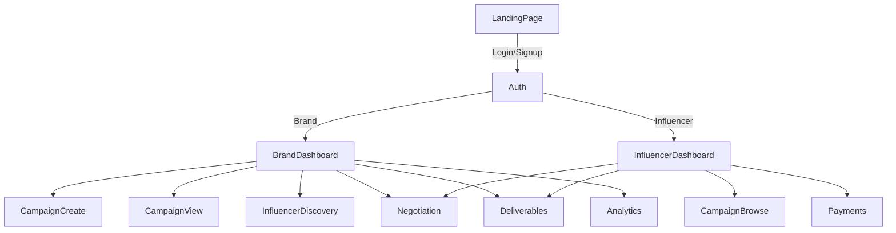

# CollabSphere

**CollabSphere** is an AI-powered influencer marketing platform that helps brands and influencers connect, collaborate, and grow. With smart campaign management, automated negotiation, and real-time analytics, CollabSphere streamlines the entire influencer marketing process for both brands and creators.

---

## 🚀 Features

- **AI Campaign Assistant:** Automate influencer discovery, outreach, and negotiation.
- **Smart Matching:** Instantly find influencers that fit your campaign goals and audience.
- **End-to-End Campaign Management:** Create, edit, and track campaigns from one dashboard.
- **Deliverables & Feedback:** Manage content submissions, approvals, and feedback in real time.
- **Contracts & Payments:** Generate, sign, and track contracts and payments securely.
- **Analytics:** Monitor campaign performance, ROI, and AI-driven insights.
- **Modern UI:** Clean, responsive, and intuitive interface for all users.

---

## 👥 Who Is This For?

- **Brands & Agencies:** Looking to run influencer campaigns efficiently and at scale.
- **Influencers & Creators:** Seeking new brand collaborations and streamlined communication.
- **Developers:** Wanting to contribute to a modern Next.js/React/TypeScript project.

---

## 🛠️ Tech Stack

- **Frontend:** Next.js (App Router), React, TypeScript, Tailwind CSS
- **Backend/API:** RESTful endpoints (see `/lib/api`)
- **AI:** Integrated AI negotiation and matching (simulated for demo)
- **UI Components:** Custom, reusable components (see `/components`)
- **State Management:** React hooks (`useState`, `useEffect`)
- **Deployment:** Ready for Vercel or any Node.js hosting

---

## 🏁 Getting Started

1. **Clone the repository:**
   ```bash
   git clone https://github.com/yourusername/influencerflow.git
   cd influencerflow
   ```

2. **Install dependencies:**
   ```bash
   npm install
   # or
   yarn install
   ```

3. **Run the development server:**
   ```bash
   npm run dev
   # or
   yarn dev
   ```

4. **Open your browser:**
   - Visit [http://localhost:3000](http://localhost:3000)

---

## 🧭 Application Flow

1. **Landing Page:**  
   - Learn about CollabSphere, see features, and get started as a brand or influencer.

2. **Authentication:**  
   - Sign up or log in as a brand or influencer.

3. **Brand Dashboard:**  
   - Create and manage campaigns.
   - Discover and invite influencers.
   - Use AI to negotiate terms and contracts.
   - Track deliverables and analytics.

4. **Influencer Dashboard:**  
   - Browse and apply to campaigns.
   - Chat and negotiate with brands (AI-assisted).
   - Submit deliverables and track payments.

5. **AI Assistant:**  
   - Get recommendations, automate outreach, and optimize negotiations.

---

## 📂 Project Structure

```
/app                # Next.js app pages and routes
  /brand
    /campaigns
      [id]/         # Campaign details, edit, analytics, etc.
      [id]/edit/    # Edit campaign
/components         # Reusable UI and feature components
/lib                # API utilities and helpers
/public             # Static assets (images, icons)
/styles             # Global styles (Tailwind CSS)
```

---

## 🌐 Route Map

| Route                                      | Description                                 |
|---------------------------------------------|---------------------------------------------|
| `/`                                        | Landing page                                |
| `/brand/campaigns`                         | Brand's campaign dashboard                  |
| `/brand/campaigns/[id]`                    | Campaign details (overview, AI, tabs)       |
| `/brand/campaigns/[id]/edit`               | Edit campaign details                       |
| `/brand/campaigns/[id]/analytics`          | Campaign analytics (if implemented)         |
| `/influencer/dashboard`                    | Influencer dashboard                        |
| `/influencer/campaigns`                    | Browse/apply to campaigns                   |
| `/api/campaign`                            | API endpoint for campaign data              |
| `/components/negotiation-chatbot.tsx`      | AI negotiation chat component               |

---

## 🏗️ Core Architecture

- **Next.js App Router** for routing and layouts.
- **Component-based UI**: All UI is built from reusable React components.
- **API Layer**: All data fetching is done via `/lib/api` using Axios.
- **AI Integration**: Simulated AI negotiation and matching logic in components.
- **State Management**: Local state with React hooks; no global state library needed.
- **SSR/SSG Ready**: All browser-only code is guarded for server compatibility.

---

## 📊 Application Flow Diagram



---

## 💡 Customization

- **Add new features:** Extend components or pages as needed.
- **Integrate real AI:** Connect to your preferred AI/ML backend for negotiation and matching.
- **Theming:** Easily customize with Tailwind CSS.

---

## 📈 Analytics & Insights

- Real-time campaign stats
- AI-driven recommendations
- ROI and engagement tracking

---

## 🛡️ Security & Privacy

- Authentication required for all dashboards
- Secure contract and payment handling
- Privacy-first: No data shared without consent

---

## 🌐 Deployment

Deploy easily on [Vercel](https://vercel.com/new?utm_medium=default-template&filter=next.js&utm_source=create-next-app&utm_campaign=create-next-app-readme) or any Node.js hosting provider.

---

## 🤝 Contributing

We welcome contributions from everyone!  
Feel free to open issues, submit pull requests, or suggest features.

---

## 📝 License

This project is licensed under the MIT License.

---

**CollabSphere** – Powering the next generation of influencer marketing with AI 🚀
